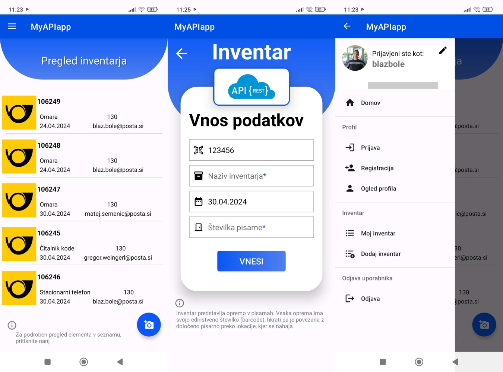
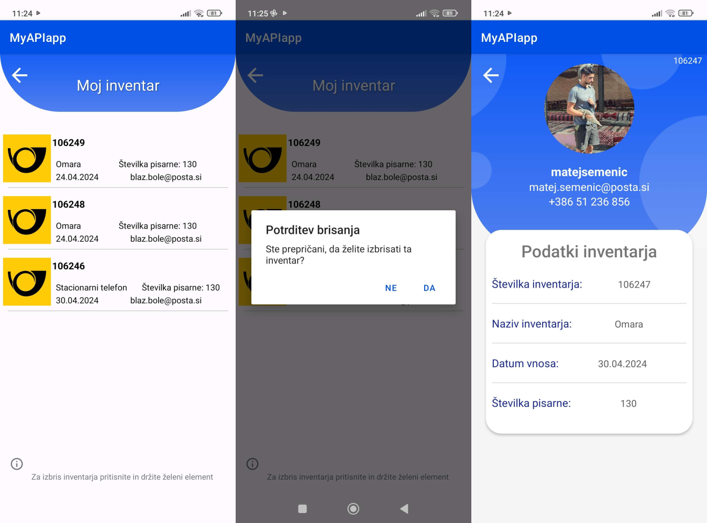

# Mobilna aplikacija za upravljanje inventarja

Aplikacija za upravljanje inventarja je namenjena uporabnikom za učinkovito in pregledno vodenje njihovega inventarja. Z uporabo te aplikacije lahko uporabniki enostavno dodajajo, urejajo in izbrišejo elemente iz svojega inventarja ter izvajajo druge pomembne funkcionalnosti.

## Registracija in prijava

Aplikacija omogoča uporabnikom, da se registrirajo in prijavijo v sistem, kar jim omogoča dostop do vseh funkcionalnosti aplikacije. Registracija uporabnikom zagotavlja lasten uporabniški račun, s katerim lahko varno upravljajo s svojim inventarjem.

## Dodajanje inventarja

Uporabniki lahko preko aplikacije enostavno dodajajo nove elemente v svoj inventar. S pomočjo vgrajene funkcije skeniranja črtnih kod lahko hitro in natančno vnesete podatke o izdelku v inventar, kar povečuje učinkovitost in natančnost procesa dodajanja.

## Urejanje profila

Aplikacija omogoča uporabnikom, da urejajo svoj uporabniški profil, vključno s posodabljanjem osebnih podatkov. To uporabnikom zagotavlja popoln nadzor nad njihovim profilom in zagotavlja personalizirano uporabniško izkušnjo.

## Upravljanje s seznamom inventarja

Glavna funkcija aplikacije je upravljanje s seznamom inventarja. Uporabniki lahko pregledujejo, urejajo in izbrišejo elemente iz svojega inventarja, kar jim omogoča organizacijo in upravljanje s svojimi predmeti na učinkovit in pregleden način.

## Uporaba API-jev

Aplikacija komunicira s strežnikom preko HTTP API klicev na .NET REST API. Z uporabo knjižnice Retrofit2 se vzpostavi povezava med mobilno aplikacijo in strežnikom, kar omogoča obdelavo različnih zahtevkov.

## Izgled

